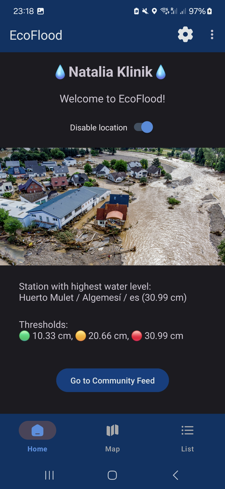
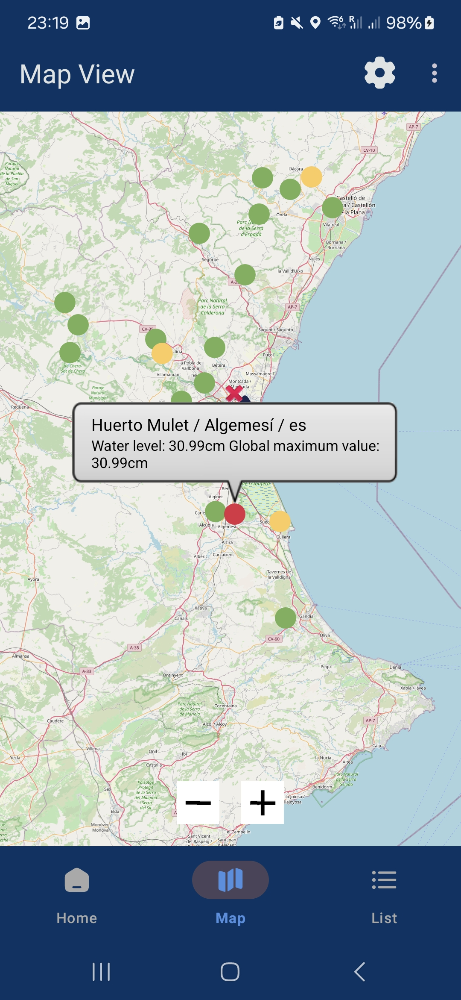
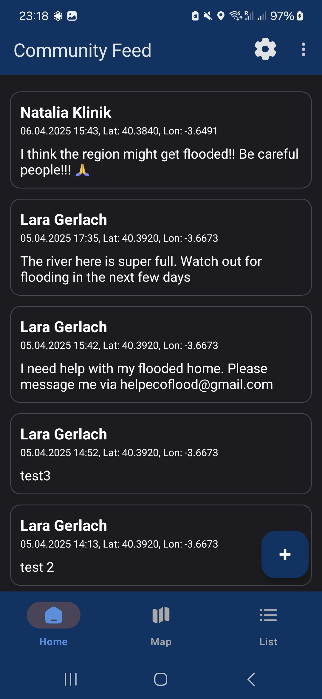

# EcoFlood

## Workspace
Github:
- Repository: https://github.com/kliniik/MAD_Kotlin
- Releases: https://github.com/kliniik/MAD_Kotlin/releases

Workspace: https://upm365.sharepoint.com/sites/NataliaandLara

Roll a dice results:
- Environmental Topics: **2** (Drought / Moisture Deficit)
- Impact on human, plants, and animals: **4** (Flooding, Landslides)
- Hints for possible solutions: **1** (Fountains, Canals, Waterways)

## Description
EcoFlood is a mobile app designed to help prevent disaster by keeping users informed and safe during flood events. It delivers real-time information based on hydrological data and user-generated reports. With features like GPS tracking, interactive maps, and a community feed, the app ensures users can access vital information in emergency situations. Users can also report flooding in their area, contributing to a community-driven platform for awareness and prevention.

## Screenshots and Navigation
|  |  |  | 
|------------------------------|------------------------------|------------------------------|

## Demo Video
Short video demonstrating how the app works and all its features:  
[to be added]  

[App Overview](https://upm365-my.sharepoint.com/:v:/g/personal/n_klinik_alumnos_upm_es/Ef4AgLY4ycNHjniF9KE6WUQBunDQt_4iA5y7SE-0HYgfXg?e=ogf0rw&nav=eyJyZWZlcnJhbEluZm8iOnsicmVmZXJyYWxBcHAiOiJTdHJlYW1XZWJBcHAiLCJyZWZlcnJhbFZpZXciOiJTaGFyZURpYWxvZy1MaW5rIiwicmVmZXJyYWxBcHBQbGF0Zm9ybSI6IldlYiIsInJlZmVycmFsTW9kZSI6InZpZXcifX0%3D)

## Features
- Functional Features
  - Real-Time Information: Users receive up-to-date flood risk alerts based on hydrological data and crowdsourced reports.
  - GPS Tracking & Map Integration: Displays high-risk flood zones and shows the user's current location on an interactive map.
  - Incident Reporting: Users can report flooded areas or landslides, contributing to a shared, real-time data pool.
  - Community Feed: Keeps users informed and engaged, allowing them to support others during emergencies.

- Technical Features
  - API Integration: Uses the Pegelalarm API to access water level data from approximately 30,000 monitoring stations worldwide. Access available until July 15, 2025.
  - Firebase Authentication: Users can sign in with Firebase (including Google login) to report incidents and engage with community features.
  - Crowdsourced Data: Aggregates and displays user-submitted reports in real time, making EcoFlood a truly community-driven platform.

## How to Use
1. Install the app from GitHub.
2. Create an account using Firebase authentication (Google login supported).
3. Enable location services on your device to allow GPS tracking.
4. View flood zones and your current position on the interactive map.
5. Report incidents such as flooding or landslides using the in-app reporting tool.
6. Share the app with your community to help keep your family and neighbors safe.

## Participants
- Natalia Klinik (n.klinik@alumnos.upm.es)
- Lara Gerlach (lara.gerlach@alumnos.upm.es)

Workload distribution between members: 50% | 50%
