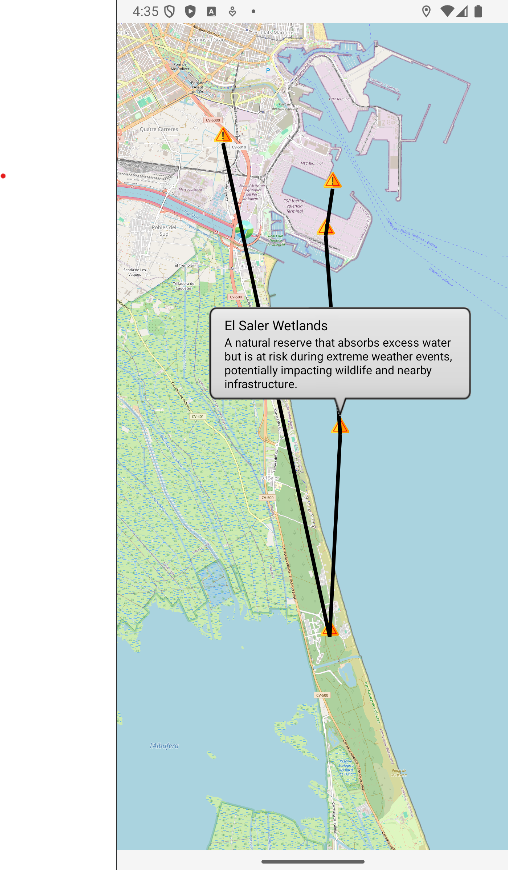
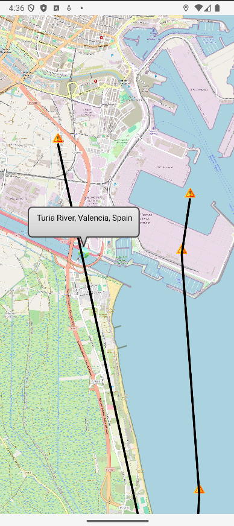

# MAD_Kotlin

## Workspace
Github:
- Repository: https://github.com/kliniik/MAD_Kotlin
- Releases: https://github.com/kliniik/MAD_Kotlin/releases

Workspace: https://upm365.sharepoint.com/sites/NataliaandLara

## Description
EcoFlood is a disaster-prevention mobile app designed to help users stay informed and safe during floods and landslides. It provides real-time alerts based on weather data and crowdsourced reports from users. The app features GPS tracking, map integration, and offline capabilities to ensure that users have access to critical information even during emergencies. Additionally, users can report incidents like flooding or landslides, helping to build a community-driven platform for disaster prevention and awareness.

## Screenshots and Navigation

## Demo Video
Short video demonstrating how the app works and all its features:  
[to be added]  

[App Overview](https://upm365-my.sharepoint.com/:v:/g/personal/n_klinik_alumnos_upm_es/Ef4AgLY4ycNHjniF9KE6WUQBunDQt_4iA5y7SE-0HYgfXg?e=ogf0rw&nav=eyJyZWZlcnJhbEluZm8iOnsicmVmZXJyYWxBcHAiOiJTdHJlYW1XZWJBcHAiLCJyZWZlcnJhbFZpZXciOiJTaGFyZURpYWxvZy1MaW5rIiwicmVmZXJyYWxBcHBQbGF0Zm9ybSI6IldlYiIsInJlZmVycmFsTW9kZSI6InZpZXcifX0%3D)

## Features
Functional features of the app:
- Real-time alerts: Users receive notifications about flood and landslide risks based on weather data and crowdsourced reports.
- GPS tracking & map integration: Displays high-risk flood zones and allows users to view their current location on a map.
- Incident reporting: Users can report flooded areas or landslides, contributing to a real-time data pool.
- Offline mode: Saves flood-prone areas locally, enabling access without an internet connection during a disaster.
- Navigation & evacuation routes: Provides safe evacuation routes and navigation options to guide users out of flood-affected areas.

Technical features of the app:
- Weather API integration: Utilizes weather APIs for real-time flood and landslide alerts based on environmental data.
- Firebase authentication: Users can log in and authenticate with Firebase to report incidents and access community data.
- Crowdsourced data: Collects and displays reports from users in real-time, making the app a community-driven platform.

## How to Use
1. Install the app from the Google Play Store or GitHub.
2. Create an account using Firebase authentication (Google login available).
3. Enable location services on your device for GPS tracking.
4. View flood & landslide zones on the integrated map.
5. Enable push notifications to receive real-time alerts for flood and landslide risks in your area.
6. Report incidents by submitting data on flooded areas or landslides via the app’s reporting feature.
7. Access offline maps of high-risk areas for situations where you have no internet access.

## Participants
- Natalia Klinik (n.klinik@alumnos.upm.es)
- Lara Gerlach (lara.gerlach@alumnos.upm.es)

Workload distribution between members: 50% | 50%
